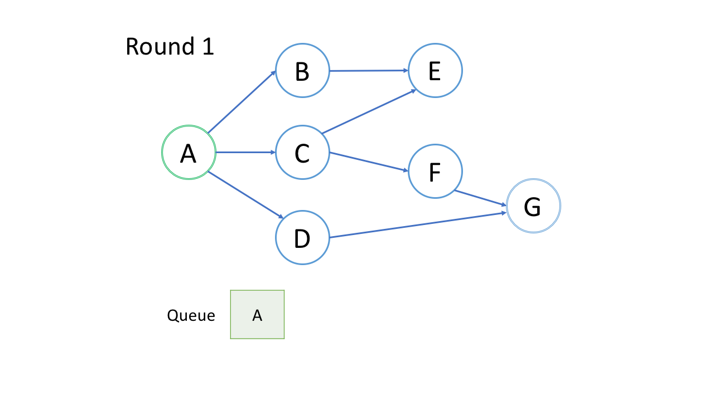

# Queue and BFS

One common application of Breadth-first Search (BFS) is to find the shortest path from the root node to the target node.
 
 
[] 
Here if we do bfs we will get 
[A] -> [B,C,D] -> [C,D,E] -> [D,E,F]-> [E,F,G] ...
